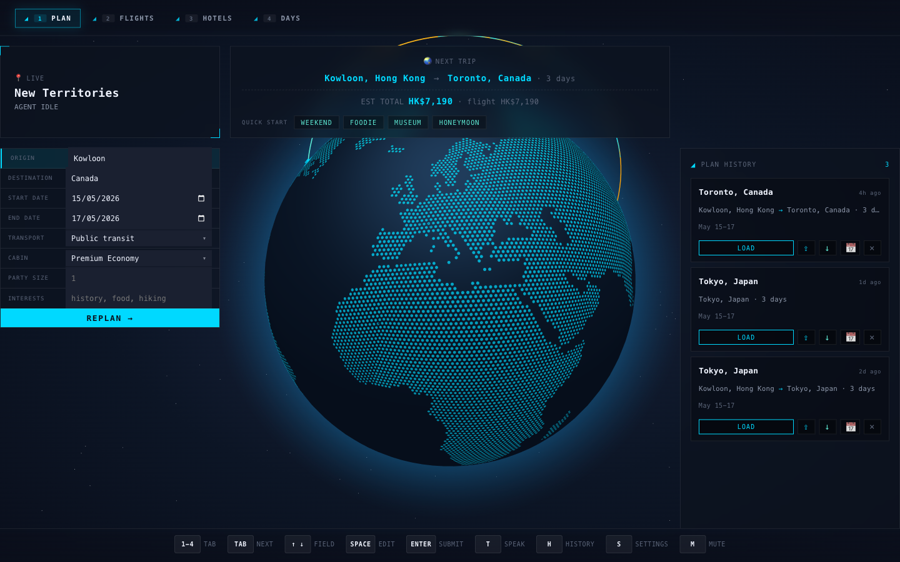

# AI Travel Agent ✈

This is a multimodal travel-planning agent that accepts voice or text, fetches live flight, hotel, and place data through tool calls, and renders a day-by-day itinerary in an in-game-style menu shell. Submitted for CUHK CSCI3280.



## Features

### Multimodal interface

- **Voice in, voice out** — browser Web Speech API for STT and xAI TTS (`ara` voice) for high-quality audio output, with browser `SpeechSynthesis` as an automatic fallback
- **Chat popover as a UI agent** — press `T` or `⌘K` to open; the chat LLM can navigate panels, pre-fill the trip form, pick a flight, swap a hotel, or replace an activity via tool calls
- **Subtitle strip** — live narration of what tool the agent is calling (`Searching flights…`, `Routing the next leg…`), with a history popover to review past utterances

### Keyboard driven menu shell

- Five numbered tabs (1 PLAN · 2 FLIGHTS · 3 HOTELS · 4 DAYS · 5 EXPORT) with keyboard navigation (number keys, Tab, ↑/↓, Space, Esc)
- Overlays: `?` help · `S` settings · `H` history · `L` checklist · `F` favorites · `C` service status
- Long-press `Q` (2 s) to start a new trip; `⌘Z` / `⌘⇧Z` for undo / redo of picks; `M` to mute TTS

### Live planning pipeline (three-stage)

- **PLAN** — LLM calls `search_flights`, `geocode_city`, `get_day_windows`, and `get_phrasebook`; emits flight options and navigates to FLIGHTS
- **HOTELS** — after a flight is picked, the LLM calls `search_places` in parallel with `get_weather` and emits hotel options on a Leaflet map with price and rating filters
- **DAYS** — after a hotel is picked, a two-phase day planner emits day themes first, then per-day activity schedules anchored to the hotel and flight arrival / departure times

### Progressive streaming

The `/chat/stream` endpoint emits SSE events (`tool_start`, `tool_end`, `partial_itinerary`, `done`) so flight options render **~7.4 s before** the full response. See [`docs/perf/streaming-benchmark.md`](docs/perf/streaming-benchmark.md).

### Export and offline use

- `EXPORT` produces a printable PDF (WeasyPrint) and a KML file that opens in Google Maps / Earth
- Plan history persists to `localStorage`; drag a `.json` plan onto the history panel to import it on another device

## Quick start

### 1. Get API keys

| Key | Where | Used for |
|---|---|---|
| `XAI_API_KEY` | https://x.ai/api | Primary LLM (Grok 4.20) + TTS (`ara` voice) |
| `GOOGLE_MAPS_API_KEY` | https://console.cloud.google.com | Places (New) · Routes · Weather · Geocoding · Time Zone |
| `GEMINI_API_KEY` | https://aistudio.google.com | Fallback LLM (Gemini 3.1 Pro Preview) — free tier works |
| `OPENROUTER_API_KEY` | https://openrouter.ai | Optional — enables Kimi K2 and MiniMax M2.7 fallbacks |

To activate the optional OpenRouter fallbacks, also set `OPENROUTER_PROXY`; without it, the chain safely skips those entries and uses Gemini when configured.

Copy `.env.example` to `.env` and fill them in. The repo ships with `LLM_MODEL=grok-4.20-0309-non-reasoning` — see [`docs/bench-2026-04-26.md`](docs/bench-2026-04-26.md) for the 6-model benchmark that drove this choice.

### 2. Backend

```bash
cd backend
python -m venv .venv
source .venv/bin/activate
pip install -r requirements.txt
uvicorn app.main:app --reload --port 8000
```

### 3. Frontend

```bash
cd frontend
npm install
npm run dev
```

### 4. Open the app

Visit <http://localhost:5173>. Fill the PLAN form (origin, destination, dates, transport, party, interests) and press **START PLANNING** — or press `T` to speak or type your request through the chat popover.

### One-command dev mode

```bash
./scripts/dev.sh          # starts both servers
./scripts/smoke-test.sh   # runs backend pytest + frontend build
./scripts/restart.sh      # kills stale ports and restarts both
```

## Tech stack

| Layer | Choice |
|---|---|
| LLM (primary) | xAI Grok 4.20 (`grok-4.20-0309-non-reasoning`) via OpenAI SDK against `api.x.ai` |
| LLM (fallback chain) | Kimi K2-0905 → MiniMax M2.7 → Gemini 3.1 Pro Preview, score-ranked; tried in order on outage or region block |
| STT | Browser Web Speech API |
| TTS | xAI TTS `ara` voice via `/speech/tts`; degrades to browser `SpeechSynthesis` on 503 |
| Flights | `fast-flights` (scrapes Google Flights) + deterministic price fallback |
| Places, Routes, Weather, Geocoding | Google Maps Platform — one key, five APIs |
| Backend | Python 3.12 · FastAPI + `uvicorn` · `httpx` · `weasyprint` |
| Frontend | React 19 · Vite 8 · Leaflet · three.js (globe view) |

See [`CLAUDE.md`](CLAUDE.md) for project conventions and the `docs/` references below for design and behaviour specs.

## Testing

```bash
cd backend && pytest         # 384 tests, mocked (no API keys required)
cd backend && ruff check .
cd frontend && npm test      # 57 vitest component + hook tests
cd frontend && npm run lint
cd frontend && npm run build # verifies the bundle compiles

# E2E tests — requires the dev server running on http://localhost:5173
# First time: npm install && npx playwright install chromium
cd frontend && npm run test:e2e
```

`MOCK_TOOLS=1` replaces every tool in `TOOL_DISPATCH` with a fixture-returning stub (see `backend/app/tools/mock_dispatch.py`) so the end-to-end LLM / SSE / tool-call loop is exercised without real API keys.

## Documentation

- [`CLAUDE.md`](CLAUDE.md) — conventions, dev commands, required Playwright walkthrough checklist
- [`CHANGELOG.md`](CHANGELOG.md) — per-round feature history
- [`docs/design.md`](docs/design.md) — interaction model, panel contract, LLM role scoping
- [`docs/llm-spec.md`](docs/llm-spec.md) — 82 numbered LLM behaviour requirements (R-G-*, R-PLAN-*, R-HOTELS-*, R-DAYS-*, R-CHAT-*, R-REPLACE-*, R-THEMES-*, R-DETAIL-*) with test coverage
- [`docs/frontend-architecture.md`](docs/frontend-architecture.md) — component tree, state model, SSE flow, hotkey system
- [`docs/api.md`](docs/api.md) — REST / SSE API reference
- [`docs/reference.md`](docs/reference.md) — SSE event stream, hotkey scope, favorites, checklist, currency, data schemas, static data files
- [`docs/user-flow.md`](docs/user-flow.md) — happy-path and clarification flows with `callRole` wiring
- [`docs/bench-2026-04-26.md`](docs/bench-2026-04-26.md) — final 6-model benchmark (rubric v3, 6 prompts × 3 runs)
- [`docs/perf/streaming-benchmark.md`](docs/perf/streaming-benchmark.md) — SSE streaming latency measurements
- [`docs/LEARNINGS.md`](docs/LEARNINGS.md) — engineering lessons from the iteration rounds
- [`docs/final-report/main.pdf`](docs/final-report/main.pdf) — public version of the final report
